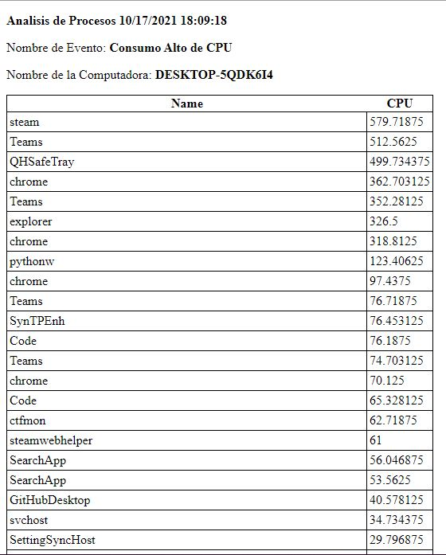
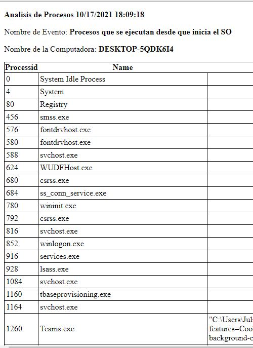
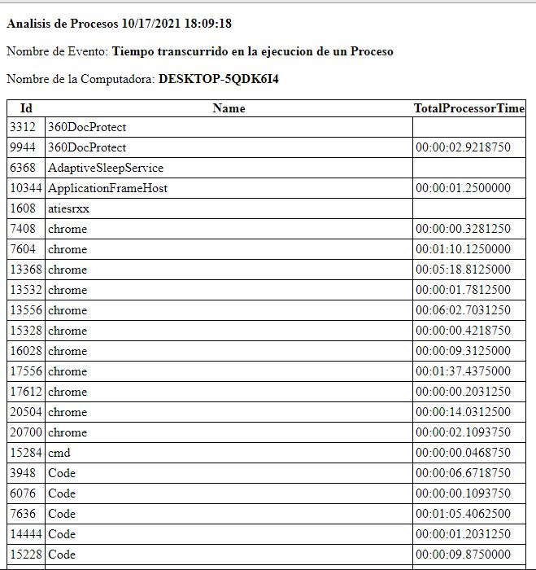
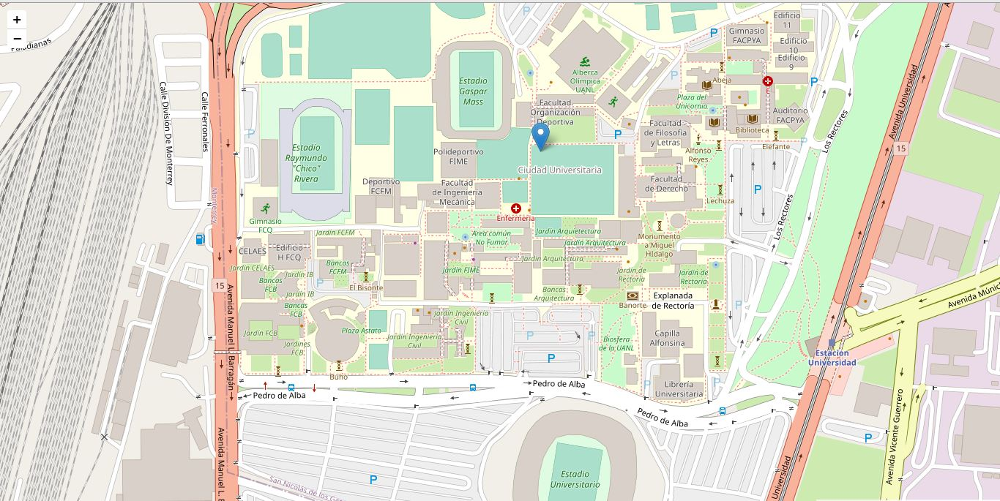

# &nbsp;&nbsp;

_Vii es un script desarrollado en python y powershell contiene
herramientas muy utiles para la ciberseguridad como obtener la Metadata de imagenes, ver los procesos que realiza nuestra computadora, podemos hacer web scraping entre otras cosas más, es muy util para obtener informacion de manera automatizada_

### Pre-requisitos 📋

_Necesitaras instalar estos modulos en python para que funcione correctamente el script, debes crear un archivo txt con el nombre que quieras y guardarlo en Desktop debera contener lo siguiente_

_Modulos.txt_
```
folium==0.12.1
requests==2.25.1
opencage==2.0.0
shodan==1.25.0
lxml==4.6.3
beautifulsoup4==4.10.0
dnspython==2.1.0
Pillow==8.4.0
```
_En el cmd ejecutamos el siguente comando_
```
C:\Users\Julio\Desktop> pip install -r Modulos.txt
```
##### Api key 👀

_Deberas crear una cuenta y obtener una api key, tiene versiones gratuitas pero con limitaciones_

* [Shodan](https://www.shodan.io/) - Pagina principal
* [Opencagedata](https://opencagedata.com/) - Pagina principal


### Instrucciones 🔧

_Es muy sencillo utilizar Vii podemos pedir ayuda primero tenemos que dirigirnos a la carpeta donde tenemos Vii
en mi caso la ruta es la siguiente_
```
C:\Users\Julio> cd "C:\Users\Julio\Desktop\PIA"
```
_luego escribimos lo siguiente_
```
C:\Users\Julio\Desktop\PIA>python Vii.py -h
```
_esto nos dara como resultado lo siguiente_
```
usage: Vii.py [-h] -Name Nombre [-r Ruta] [-url Url] [-msg Mensaje] [-c Correo] [-s Asunto] [-e Destinatario] [-ip IP]
              [-port Puerto] [-key key] [-b Buscar] [-d Dominio] [-ln Latitud] [-lg Longitud]

___ _      ___ _  ___ _   ___ _
\  \ \    /  / / |   | | |   | |
 \  \ \  /  / /  |   | | |   | |
  \  \ \/  / /   |   | | |   | |
   \  \/  / /    |   | | |   | |
    \_ _ /_/     |_ _|_| |_ _|_|

optional arguments:
  -h, --help       show this help message and exit
  -Name Nombre     Nombre de la Herramienta Vii
  -r Ruta          Ruta de la carpeta con las imagenes
  -url Url         Link de la pagina Web
  -msg Mensaje     Mensaje a enviar al corro
  -c Correo        Correo electronico
  -s Asunto        Encabezado del mensaje
  -e Destinatario  Cuenta que recibira el correo
  -ip IP           IP del equipo
  -port Puerto     Puerto a analizar
  -key key         Api key de la cuenta
  -b Buscar        Palabra a Buscar
  -d Dominio       Dominio del DNS
  -ln Latitud      Distancia en grados, minutos y segundos respecto al paralelo principal
  -lg Longitud     Distancia en grados, minutos y segundos respecto al meridiano principal

<---------------------------------------------------- Herramientas Vii ----------------------------------------------------->

 Name      Descripcion                                              Ejemplos
------ --------------------- -----------------------------------------------------------------------------------------------
[Proc] Analizar Procesos     python Vii.py -Name Proc
[Wsc]  Web Scraping          python Vii.py -Name Wsc -url "Url de la pagina"
[Md]   Metadata de Imagenes  python Vii.py -Name Md -r C:\Users\Alonso\Downloads\Imagenes\
[Env]  Enviar correos        python Vii.py -Name Env -msg "Tu mensaje" -c "Correo" -s "Asunto del mensaje" -e "Destinatario"
[PA]   Analizar los puertos  python Vii.py -Name PA -ip "Tu IP" -port "Puerto a analizar"
[BS]   Api shodan            python Vii.py -Name BS -key "Api key" -b "Buscar"
[DNS]  Registros DNS         python Vii.py -Name DNS -d "domino del DNS"
[DIP]  Obtener dominio IP    python Vii.py -Name DIP -ip "IP del DNS"
[UC]   Obtener ubicacion     python Vii.py -Name UC -key "Api key" -ln "Latitud" -lg "Longitud"
```
_podemos ver que nos da unos ejemplos de como usar las herramientas de Vii. 
Al utilizar la herramienta Proc nos da un informe sobre los procesos que realiza nuestra PC
con esto podemos identificar si hay un malware ejecutandose o tambien podemos ver le rendimiento 
del CPU_
```
C:\Users\Julio\Desktop\PIA> python Vii.py -Name Proc
```
_nos da como resultado lo siguiente_
```
Analisis de Procesos Exitosa
```
_nos crea archivos html donde podemos ver de una forma facil y legible_ 

&nbsp;&nbsp; &nbsp;&nbsp; &nbsp;&nbsp;

_Si usamos ahora la herramienta Wsc, la forma de usarlo es_ 
```
python Vii.py -Name Wsc -url "Url de la pagina"
```
_Para este ejemplo usaremos la pagina uanl.com
nos da como resultado lo siguiente_
```
----Correos encontrados----
contactouni@uanl.mx
############################
Obteniendo imagenes de la url: https://www.uanl.mx/
Imagenes 36 encontradas
Obteniendo pdfs de la url: https://www.uanl.mx/
Ya existe el subdirectorio o el archivo pdf_encontrados.
Encontrados 4 pdf

Obteniendo links de la url:https://www.uanl.mx/
links 220 encontrados
```
_esto nos va ahorrar mucho tiempo a la hora de querer obtener informacion de una pagina
nos dara los correos encontrados en la pagina, las imagenes, los pdf y obtendra todos los links.
las imagenes las descarga y las guarda en una carpeta, los mismo pasa con los pdf encontrados, con
los correos encontrados y los links los guarda en un archivo txt_
```
imagenes 
pdf_encontrados
Correos.txt
Links.txt
```
_La herramienta Md nos dara la metadata de las imagenes aunque con esta herramienta no funciona con 
todas las imagenes funciona de la siguiente manera_
```
python Vii.py -Name Md -r "ruta"
python Vii.py -Name Md -r C:\Users\Alonso\Downloads\Imagenes\
```
_nos dara como resultado lo siguiente_
```
.\20190513_104551.jpg
[+] Metadata for file: 20190513_104551.jpg
Metadata: ImageWidth - Value: 4032
Metadata: ImageLength - Value: 3024
Metadata: GPSInfo - Value: {'Lat': 48.8573785, 'Lng': 2.296264299722222}
Metadata: ResolutionUnit - Value: 2
Metadata: ExifOffset - Value: 238
Metadata: Make - Value: samsung
Metadata: Model - Value: SM-G970F
Metadata: Software - Value: G970FXXU1ASD5
Metadata: Orientation - Value: 6
Metadata: DateTime - Value: 2019:05:13 10:45:51
Metadata: YCbCrPositioning - Value: 1
Metadata: XResolution - Value: 72.0
Metadata: YResolution - Value: 72.0
Metadata: ExifVersion - Value: b'0220'
Metadata: ShutterSpeedValue - Value: 0.0007575757575757576
Metadata: ApertureValue - Value: 2.52
Metadata: DateTimeOriginal - Value: 2019:05:13 10:45:51
Metadata: DateTimeDigitized - Value: 2019:05:13 10:45:51
Metadata: BrightnessValue - Value: 22.45
Metadata: ExposureBiasValue - Value: 0.0
Metadata: MaxApertureValue - Value: 2.52
Metadata: MeteringMode - Value: 2
Metadata: Flash - Value: 0
Metadata: FocalLength - Value: 4.32
Metadata: ColorSpace - Value: 1
Metadata: ExifImageWidth - Value: 4032
Metadata: DigitalZoomRatio - Value: 1.0
Metadata: FocalLengthIn35mmFilm - Value: 26
Metadata: SceneCaptureType - Value: 0
Metadata: ExifImageHeight - Value: 3024
Metadata: ExposureTime - Value: 0.0007575757575757576
Metadata: FNumber - Value: 2.4
Metadata: ImageUniqueID - Value: L12XLLD00SM
Metadata: ExposureProgram - Value: 2
Metadata: ISOSpeedRatings - Value: 50
Metadata: ExposureMode - Value: 0
Metadata: WhiteBalance - Value: 0
```
_lo mas interesante de la metadata es la parte de gpsinfo donde nos da informacion util 
sobre la ubicacion donde fue tomada la foto, como tambien la marca, version del dispositivo y 
tambien tenemos una herramienta de geolocalizacion que nos permite obtener la direccion y nos da
un mapa sobre las coordenadas dadas_

_La herramienta Env nos ayudara a enviar correos de una manera automatizada estos nos ayuda en 
ahorrar tiempo, para usarla necesitos hacer lo siguiente_
```
python Vii.py -Name Env -msg "Tu mensaje" -c "Tu_Correo" -s "Asunto del mensaje" -e "Destinatario"
```
_luego de dar enter te pedira la contraseña de tu correo_
```
C:\Users\Julio\Desktop\PIA> python Vii.py -Name Env -msg "Tu mensaje" -c "Tu_Correo" -s "Asunto del mensaje" -e "Destinatario"
Password:
```
_nos dara como resultado lo siguiente_
```
C:\Users\Julio\Desktop\PIA> python Vii.py -Name Env -msg "Tu mensaje" -c "Tu_Correo" -s "Asunto del mensaje" -e "Destinatario"
Password:
[+]Conectando con el servidor....
[+]Iniciando la sesion Encriptada....
[+]Loging en el servidor....
[+]Enviando mail....
[+]Se envio el email correctamente
```
_la herramienta PA nos permite visualizar los puertos abiertos de un dispositivo por medio 
de su ip, la forma de utilizarlo es mediante el siguiente comando_
```
python Vii.py -Name PA -ip "Tu IP" -port "Puerto a analizar"
```
_Nota solo se puede analizar un puerto a la vez, si ejecutamos este comando_
```
python Vii.py -Name PA -ip "192.158.1.38" -port 80
```
_nos da como resultado_ 
```
Puerto 80 : Cerrado
```
_Esto cambiara dependiendo de la ip del dispositivo_
_La herramienta BS nos ayuda en hacer solicitudes a la api de shodan en ella 
podemos buscar ip de servidores apache, para usarlo solo hacemos lo siguiente_
```
python Vii.py -Name BS -key "Tu_Api_key" -b "apache"
```
_nos dara como resultado, lo siguiente_
```
Results found: 17819873
IP: 94.78.20.191
<html><head><title>Apache Tomcat/7.0.41 - Error report</title><style><!--H1 {font-family:Tahoma,Arial,sans-serif;color:white;background-color:#525D76;font-size:22px;} H2 {font-family:Tahoma,Arial,sans-serif;color:white;background-color:#525D76;font-size:16px;} H3 {font-family:Tahoma,Arial,sans-serif;color:white;background-color:#525D76;font-size:14px;} BODY {font-family:Tahoma,Arial,sans-serif;color:black;background-color:white;} B {font-family:Tahoma,Arial,sans-serif;color:white;background-color:#525D76;} P {font-family:Tahoma,Arial,sans-serif;background:white;color:black;font-size:12px;}A {color : black;}A.name {color : black;}HR {color : #525D76;}--></style> </head><body><h1>HTTP Status 404 - /asdadadas</h1><HR size="1" noshade="noshade"><p><b>type</b> Status report</p><p><b>message</b> <u>/asdadadas</u></p><p><b>description</b> <u>The requested resource is not available.</u></p><HR size="1" noshade="noshade"><h3>Apache Tomcat/7.0.41</h3></body></html>

IP: 54.173.69.168
HTTP/1.1 200 OK
Date: Mon, 18 Oct 2021 00:08:34 GMT
Server: Apache
Last-Modified: Thu, 11 Jan 2018 22:13:43 GMT
ETag: "126-562877602c65c"
Accept-Ranges: bytes
Content-Length: 294
Vary: Accept-Encoding
Content-Type: text/html


IP: 82.218.179.34
HTTP/1.1 403 Forbidden
Date: Mon, 18 Oct 2021 00:08:34 GMT
Server: Apache
Content-Length: 199
Content-Type: text/html; charset=iso-8859-1
```
_nos dara una cantidad increible de informacion pero lo mas interesante de estas busquedas son las ip
por lo tanto esta herramienta genera un archivo txt con todas las ip de la busqueda de servidores apache_
```
IP.txt
```
_La herramienta DNS es muy util para obtener registros sobre los DNS
para usarlo usaremos este comando_
```
python Vii.py -Name DNS -d "domino del DNS"
python Vii.py -Name DNS -d "google.com"
```
_nos dara como resultado lo siguiente_
```
Registros de Servidores de correo
---------------------------------
id 18380
opcode QUERY
rcode NOERROR
flags QR RD RA
;QUESTION
google.com. IN MX
;ANSWER
google.com. 600 IN MX 10 aspmx.l.google.com.
google.com. 600 IN MX 50 alt4.aspmx.l.google.com.
google.com. 600 IN MX 20 alt1.aspmx.l.google.com.
google.com. 600 IN MX 30 alt2.aspmx.l.google.com.
google.com. 600 IN MX 40 alt3.aspmx.l.google.com.
;AUTHORITY
;ADDITIONAL

Registros de Servidores de nombre
-----------------------------------
id 21860
opcode QUERY
rcode NOERROR
flags QR RD RA
;QUESTION
google.com. IN NS
;ANSWER
google.com. 63546 IN NS ns3.google.com.
google.com. 63546 IN NS ns1.google.com.
google.com. 63546 IN NS ns4.google.com.
google.com. 63546 IN NS ns2.google.com.
;AUTHORITY
;ADDITIONAL
ns3.google.com. 62665 IN A 216.239.36.10
ns3.google.com. 114067 IN AAAA 2001:4860:4802:36::a
ns1.google.com. 62558 IN A 216.239.32.10
ns1.google.com. 185624 IN AAAA 2001:4860:4802:32::a
ns4.google.com. 62558 IN A 216.239.38.10
ns4.google.com. 114067 IN AAAA 2001:4860:4802:38::a
ns2.google.com. 62782 IN A 216.239.34.10
ns2.google.com. 114067 IN AAAA 2001:4860:4802:34::a

Registros de Direcciones IPV4
-------------------------------
id 53198
opcode QUERY
rcode NOERROR
flags QR RD RA
;QUESTION
google.com. IN A
;ANSWER
google.com. 41 IN A 142.251.32.206
;AUTHORITY
;ADDITIONAL

Registros de direcciones IPV6
-------------------------------
id 21048
opcode QUERY
rcode NOERROR
flags QR RD RA
;QUESTION
google.com. IN AAAA
;ANSWER
google.com. 113 IN AAAA 2607:f8b0:4000:80a::200e
;AUTHORITY
;ADDITIONAL
```
_otra herramienta que nos podria servir es DIP
con esta herramienta obtendremos el nomnbre del domino con solo la ip
para usarlo solo necesitamos escribir lo siguiente_
```
python Vii.py -Name DIP -ip "IP del DNS"
python Vii.py -Name DIP -ip "10.0.1.11"
```
_esto nos dara como resultado lo siguiente_
```
11.0.0.10.in-addr.arpa.
```
_este seria el nombre del domnio de la ip dada_

_La herramienta UC usa la api de opencagedata y nos dara informacion util tan solo 
dando la latitud y longitud es por eso que la herramienta Md y UC van de la mano ya que 
una extrae la metadata para obtener la GPSinfo y la otra se encarga de mostrarnos un mapa 
con la ubicacion por medio de la coordenadas y para usarlo hacemos lo siguiente_
```
python Vii.py -Name UC -key "Api key" -ln "Latitud" -lg "Longitud"
python Vii.py -Name UC -key "Tu_Api_key" -ln 25.726889250784385 -lg -100.31247243118831
```
_esto nos dara como resultado lo siguiente_
```
[{'annotations': {'DMS': {'lat': "25° 43' 38.72064'' N",
                          'lng': "100° 18' 44.10396'' W"},
                  'MGRS': '14RLP6836446152',
                  'Maidenhead': 'DL95ur24mn',
                  'Mercator': {'x': -11166708.717, 'y': 2946817.575},
                  'OSM': {'edit_url': 'https://www.openstreetmap.org/edit?way=345552924#map=17/25.72742/-100.31225',
                          'note_url': 'https://www.openstreetmap.org/note/new#map=17/25.72742/-100.31225&layers=N',
                          'url': 'https://www.openstreetmap.org/?mlat=25.72742&mlon=-100.31225#map=17/25.72742/-100.31225'},
                  'UN_M49': {'regions': {'AMERICAS': '019',
                                         'CENTRAL_AMERICA': '013',
                                         'LATIN_AMERICA': '419',
                                         'MX': '484',
                                         'WORLD': '001'},
                             'statistical_groupings': ['LEDC']},
                  'callingcode': 52,
                  'currency': {'alternate_symbols': ['MEX$'],
                               'decimal_mark': '.',
                               'disambiguate_symbol': 'MEX$',
                               'html_entity': '$',
                               'iso_code': 'MXN',
                               'iso_numeric': '484',
                               'name': 'Mexican Peso',
                               'smallest_denomination': 5,
                               'subunit': 'Centavo',
                               'subunit_to_unit': 100,
                               'symbol': '$',
                               'symbol_first': 1,
                               'thousands_separator': ','},
                  'flag': '🇲🇽',
                  'geohash': '9u8dm7dc55hhx2g6hs7s',
                  'qibla': 43.03,
                  'roadinfo': {'drive_on': 'right',
                               'road': 'Avenida Fidel Velázquez',
                               'speed_in': 'km/h'},
                  'sun': {'rise': {'apparent': 1634560980,
                                   'astronomical': 1634556360,
                                   'civil': 1634559600,
                                   'nautical': 1634557980},
                          'set': {'apparent': 1634515740,
                                  'astronomical': 1634520360,
                                  'civil': 1634517180,
                                  'nautical': 1634518740}},
                  'timezone': {'name': 'America/Monterrey',
                               'now_in_dst': 1,
                               'offset_sec': -18000,
                               'offset_string': '-0500',
                               'short_name': 'CDT'},
                  'what3words': {'words': 'wounds.hotdog.misfits'}},
  'bounds': {'northeast': {'lat': 25.7276525, 'lng': -100.3116785},
             'southwest': {'lat': 25.7272304, 'lng': -100.3128239}},
  'components': {'ISO_3166-1_alpha-2': 'MX',
                 'ISO_3166-1_alpha-3': 'MEX',
                 '_category': 'education',
                 '_type': 'university',
                 'city': 'San Nicolás de los Garza',
                 'continent': 'North America',
                 'country': 'Mexico',
                 'country_code': 'mx',
                 'county': 'San Nicolás de los Garza',
                 'neighbourhood': 'Ciudad Universitaria',
                 'postcode': '64200',
                 'road': 'Avenida Fidel Velázquez',
                 'state': 'Nuevo León',
                 'state_code': 'NLE',
                 'university': 'Facultad Organización Deportiva'},
  'confidence': 9,
  'formatted': 'Facultad Organización Deportiva, Avenida Fidel Velázquez, '
               'Ciudad Universitaria, 64200 San Nicolás de los Garza, NLE, '
               'Mexico',
  'geometry': {'lat': 25.7274224, 'lng': -100.3122511}}]
 ```
_Todo esta es informacion muy util para saber la ubicacion mediante la obtencion de la metadata, luego 
de haber ejecutado la herramienta UC nos abrira en nuestro navegador un mapa con la ubicacion marcada con 
las coordenadas, este sera el resultado_

&nbsp;&nbsp;

## Version 📌

Esta es la version 1.00

## Autores ✒️

* **Julio Alonso** - *Trabajo Inicial, Documentación* - [JulioGrimaldoM](https://github.com/JulioGrimaldoM)

## Gracias por usar Vii🎁

* Quisiera agradecer haber tomado su tiempo para leer la documentacion 📢
* Espero le saquen provecho a Vii.
